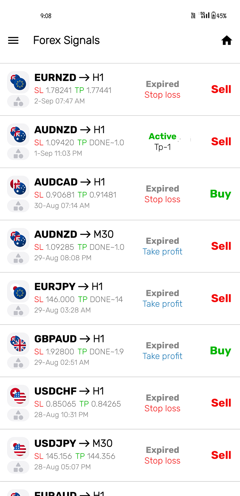
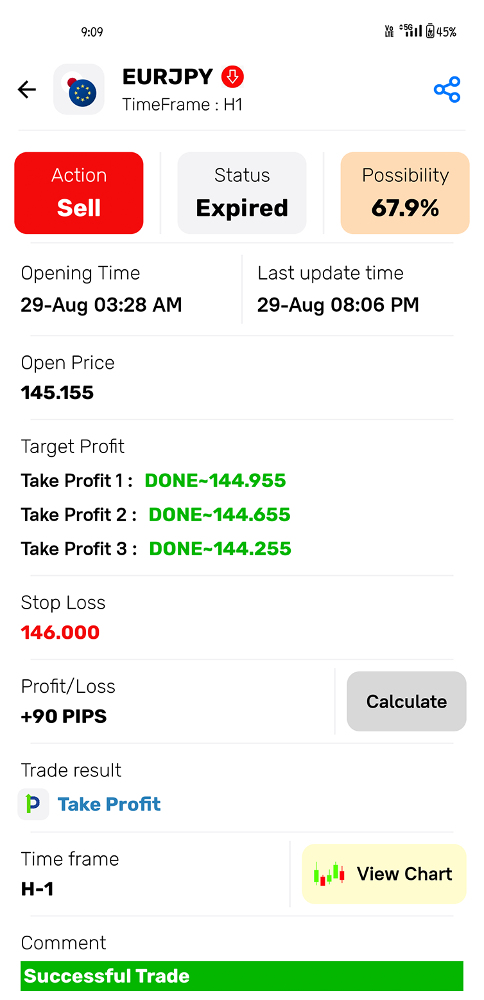

# Forex Buy Sell VIP Signal App

Forex Buy Sell VIP Signal App is an Android application that provides real-time forex trading signals, market insights, and trading alerts to help traders make better trading decisions.

## Features

- Real-time Buy and Sell forex signals
- VIP signal notifications
- Market analysis and trading insights
- Support for major currency pairs
- Easy and user-friendly interface
- Push notification alerts
- Trading tips and learning resources

## Technologies Used

- Java / Kotlin
- Android Studio
- Firebase Cloud Messaging
- REST API Integration
- XML UI Design

## Screenshots

<p align="center" float="left">
<table>
  <tr>
    <td>Home Screen</td>
    <td>Signal Screen</td>
   
  </tr>
  <tr>
    <td></td>
    <td></td>
  </tr>
 </table>
 
<p align="left">


</p>

## Installation

1. Clone the repository

```
git clone https://github.com/panthitech/forex-signal-app.git
```

2. Open the project in Android Studio.

3. Build and run the application on an Android device or emulator.

## Project Structure

```
app/
 ├── java/
 ├── res/
 ├── layouts/
 ├── activities/
 └── models/
```

## Requirements

- Android Studio
- Android SDK
- Internet connection

## Disclaimer

This application provides forex trading signals for informational purposes only. Forex trading involves financial risk. Users should trade responsibly and perform their own analysis before making trading decisions.

## Author

Shraddha Kathiriya  
Android App Developer & UI/UX Designer

GitHub: https://github.com/panthitech
